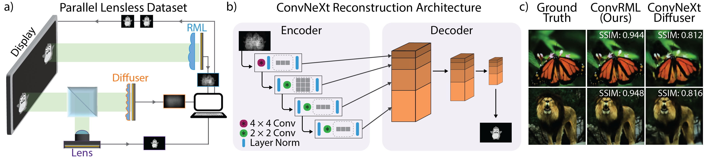

# ConvRML: High-Quality Lensless Imaging with Random Multi-Focal Lenslets

## About 

This repository contains code for the paper **ConvRML: High-Quality Lensless Imaging with Random Multi-Focal Lenslets**.

[](https://doi.org/10.48550/arXiv.2602.04834)



## Setup

### 1. Installation

For standard usage:

```
git clone https://github.com/lakabuli/ConvRML.git
```

This repository also includes optional git submodules. Use a recursive clone for the Parallel Lensless Dataset capture and processing code and/or additional comparison models:

```
git clone --recurse-submodules https://github.com/lakabuli/ConvRML.git
```

### 2. Downloading the Datasets

* **Parallel Lensless Dataset (PLD):** Download via [Dataset Google Drive Link](https://drive.google.com/drive/folders/1CqPliG5rZIYH5zA6cXdrA6cvDF7obbvc?usp=sharing), project page coming soon!
<!-- [Waller Lab PLD Page](https://waller-lab.github.io/parallel-lensless-dataset/). -->
* **DiffuserCam Lensless Mirflickr Dataset (DLMD) — <span style="color: orange;">OPTIONAL</span>:** Download via the [Lensless Learning Dataset Page](https://waller-lab.github.io/LenslessLearning/dataset.html).

Set `dataset.data_path` in your config to the dataset root below. Folder names must match exactly; training looks them up by these relative paths.

**PLD** — point `data_path` at the PLD root containing the 4× preprocessed folders:

```
<data_path>/                          # e.g. /path/to/PLD
├── 4x_rml/                           # RML measurements (*.tiff)
│   └── 4x_img_<id>_cam_1.tiff
├── 4x_undistorted_GT2RML/            # GT warped into RML imager space
│   └── warped_4x_undistorted_img_<id>_cam_2.tiff
├── 4x_diffuser/                      # diffuser measurements (*.tiff)
│   └── 4x_img_<id>_cam_0.tiff
└── 4x_undistorted_GT2DC/             # GT warped into diffuser imager space
    └── warped_4x_undistorted_img_<id>_cam_2.tiff
```

Use the `4x_rml` + `4x_undistorted_GT2RML` pair when `dataset.name: "rml"`, or the `4x_diffuser` + `4x_undistorted_GT2DC` pair when `dataset.name: "diffuser"`. 

**DLMD / Mirflickr (optional)** — point `data_path` at the Mirflickr root containing the `.npy` folders:

```
<data_path>/                          # e.g. /path/to/mirflickr_dataset
├── diffuser_images_npy/              # lensless measurements (*.npy)
│   └── im<id>.npy
└── ground_truth_lensed_npy/          # lensed ground truth (*.npy)
    └── im<id>.npy
```

> [!NOTE]
> The default supported configuration for the PLD is `use_processed: True`. For PLD with `use_processed: False`, the loader instead expects raw folders `rml/` or `diffuser/` plus `4x_undistorted_ground_truth/`, and warps GT on the fly with the matrices in `homography_matrices/`.

### 3. Environment Installation

Create a conda environment with Python (version 3.11 was used for original development) and install PyTorch:

```
conda create -n convrml python=3.11
conda activate convrml

pip install torch torchvision --index-url https://download.pytorch.org/whl/cu118
```

Install the remaining required baseline libraries with pinned versions for reproducibility:

```
pip install numpy==2.0.2 \
            matplotlib==3.9.2 \
            scikit-image==0.24.0 \
            kornia==0.8.2 \
            tqdm==4.67.1 \
            timm==1.0.22 \
            tifffile==2025.3.13 \
            torchmetrics==1.8.2 \
            natsort==8.4.0 \
            omegaconf==2.3.0
```
> [!NOTE]
> Optional: If you wish to use Weights & Biases for experiment tracking, run `pip install wandb`. If you are not using tracking, ensure the `wandb_on` flag is set to `False` in your configuration files.

### 4. Configuration & Paths

Configure your local paths and training parameters inside the `config.yaml` files. 

#### Essential Path Settings

| YAML Key | Description |
| --- | --- | 
| `dataset.data_path` | Absolute path to the dataset folder. Must contain the subfolders for ground truth images and raw measurements. |
| `checkpoint.save_checkpoint_path` | Root directory where model weights will be saved. Subdirectories are auto-generated based on model hyper-parameters. | 
| `infer.save_infer_dir` | Root directory where all evaluation metrics and reconstructed images during inference will be saved. | 
| `infer.save_metrics` | Set to `True` to export quantitative evaluation results (MSE, PSNR, SSIM) as a serialized dictionary. | 
| `infer.save_ids` | A list of explicit integer indices (e.g., `[65, 120]`) indicating which specific images should be saved during inference. |
| `infer.save_uncropped` | Set to `True` to export uncropped reconstructed images with black borders during inference. | 


#### Optional Runtime Parameters
| YAML Key | Description |
| --- | --- | 
| `checkpoint.load_checkpoint` | Set to `True` to resume an interrupted training run from saved model weights. | 
| `checkpoint.load_path` | Exact directory path containing target model dictionaries (e.g., `"./checkpoints/convnext_0.5_rml_mse_6"`). | 
| `checkpoint.wandb_id` | Unique Weights & Biases run ID (e.g., `"qt8qezs1"`) to append data onto an already existing run log. Leave blank to generate a fresh session. | 
| `modes.wandb_on` | Set to `True` to activate live remote loss curves and visualization logging. | 
| `modes.full_fov_loss` | Set to `True` to penalize reconstruction loss over the entire field of view, including unexposed black borders. | 

## Running Pretrained Models

If you want to work directly with our existing trained models, download them with the script provided in the `checkpoints/` folder. The models are hosted externally on [Google Drive](https://drive.google.com/drive/folders/14SLe_-DuO34XiLWXBi_ExhgyKS0BUK4K?usp=sharing).

Requires `gdown` (`pip install gdown`), then:

```
./checkpoints/download_pretrained.sh
```

The download script places each model at `checkpoints/<run_name>/best_model.pth`. To get metrics and reconstructions, use `infer.py`, which will place results in `infer_results/<run_name>/`. Set `dataset.data_path` in the chosen config before running.

## Dataset Considerations & Remarks

### PLD dataset 
1. **Preprocessing Constraints:** This implementation inherently assumes the use of 4x downsampled measurements warped directly to imager space. Ensure `use_processed` is set to `True` if this is the case. Non-warped configurations are also supported, but alternative downsampling levels are not explicitly handled.
2. **AWB Homographies:** To instead work with the Automatic White Balance (AWB) version of the dataset, download AWB homographies from the project repository and hard-override the default absolute paths inside the following components:
    - The `ScalableDataset` class definition inside `dataset.py`
    - The `load_image_pair_rml_diffuser` function inside `utils.py`
    - Explicit homography dictionary paths declared in `infer.py`
3. **Splits:** The testing split mirrors the DLMD configuration, using the initial 1,000 images. However, validation is mutually exclusive from the test set, using images indexed from 1,000 to 5,000.

### DLMD dataset 
1. **File Formatting:** This code expects `.npy` files. Do not use the raw `.tiff` variants as they do not contain the complete image set.
2. **Indexing Discrepancy:** The DLMD sequence omits the first image and is not zero-indexed (indexing originates at 2). All images will be off-by-one indexed relative to our PLD dataset.
3. **Splits:** The validation and testing loaders partition and evaluate across the exact same initial 1,000 images.

## Acknowledgements & Attributions

The U-Net model architecture and weights referenced in this repository are adapted from the official implementation of **LenslessLearning**. To run corresponding components, place a `models_DLMD/` folder at the repo root containing `unet.py` and `model_unet_weights.pth`.

* **Original Repository:** [Waller-Lab/LenslessLearning](https://github.com/Waller-Lab/LenslessLearning)
* **Paper Citation:** Kristina Monakhova, Joshua Yurtsever, Grace Kuo, Nick Antipa, Kyrollos Yanny, and Laura Waller, "Learned reconstructions for practical mask-based lensless imaging," Opt. Express 27, 28075-28090 (2019)

## Citation
```bibtex
@article{Kabuli2026ConvRML,
  author = {Leyla A. Kabuli and Clara S. Hung and Vasilisa Ponomarenko and Eric Markley and Laura Waller},
  title = {ConvRML: High-Quality Lensless Imaging with Random Multi-Focal Lenslets},
  journal = {arXiv},
  year = {2026},
  doi = {10.48550/ARXIV.2602.04834},
  url = {https://arxiv.org/abs/2602.04834},
}
```
